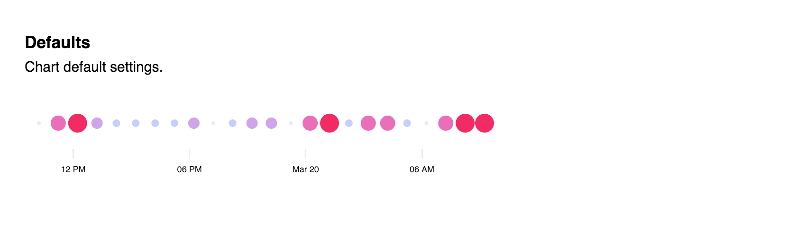

# D3 dot.

 D3 dot graph. See source for examples and documentation.



## Installation

```
$ npm install d3-dot
```

## Developing

Build:

```
$ make build
```

Start dev server:

```
$ make start
```


